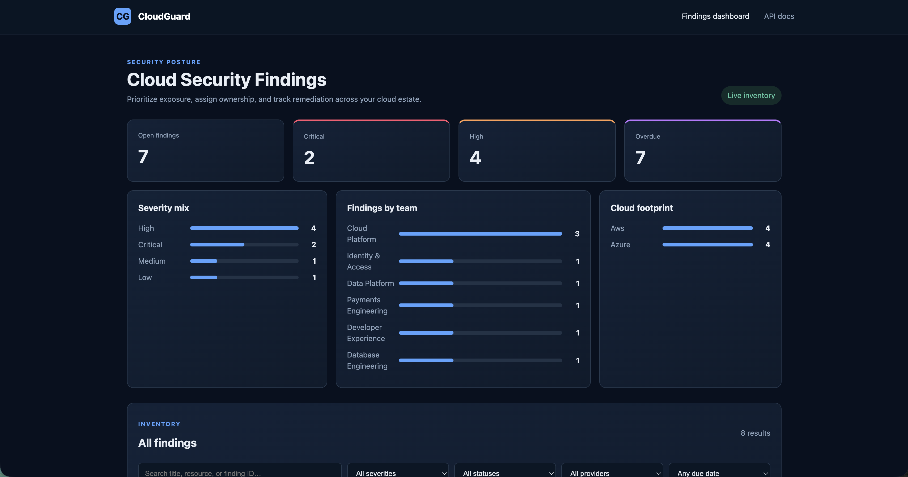
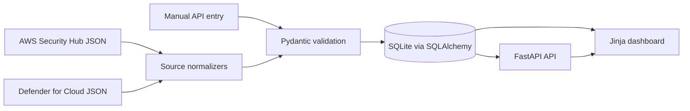

# Cloud Security Findings Dashboard

Cloud security tools are good at finding problems, but each provider reports them in a different format. This project brings simulated AWS Security Hub and Microsoft Defender for Cloud findings into one place so they can be reviewed, assigned, and tracked through remediation.

The application validates each imported record, converts provider-specific fields into a shared model, stores the result in SQLite, and displays the findings in a searchable dashboard. It is intentionally a focused MVP: there are no live cloud credentials, automated remediations, or unnecessary services involved.

## Screenshot



## What it does

- Imports realistic sample exports from AWS Security Hub and Microsoft Defender for Cloud
- Normalizes severity, status, ownership, resource, and account information
- Reports invalid records individually instead of rejecting an entire batch
- Prevents duplicate findings from the same source
- Tracks ownership, due dates, remediation guidance, and resolution notes
- Calculates overdue findings using the current date
- Records every status change in a basic audit history
- Provides summary metrics and a searchable, filterable findings table
- Exposes the same data through a documented REST API

## How it works



The project runs as a single FastAPI application. HTTP concerns live in `app/routes`, provider-specific mapping lives in `app/services/normalization.py`, and import behavior lives in `app/services/importer.py`. SQLAlchemy handles persistence, while Pydantic validates data at the API boundary. The frontend uses Jinja templates, CSS, and a small amount of plain JavaScript.

This structure keeps the code easy to follow while separating the parts most likely to change. For example, another security provider could be added by writing a new normalizer without rebuilding the dashboard or database layer.

## Run it locally

Python 3.10 or newer is recommended. The Docker image and GitHub Actions workflow use Python 3.12.

```bash
git clone https://github.com/Zach-Fogle/Cloud-security-dashboard.git
cd Cloud-security-dashboard
python3 -m venv .venv
source .venv/bin/activate
python -m pip install -r requirements.txt
python -m uvicorn app.main:app --reload
```

Open the dashboard at <http://127.0.0.1:8000>. FastAPI's interactive API documentation is available at <http://127.0.0.1:8000/docs>.

### Add the sample data

With the application running, open another terminal in the project directory and import the included sample files:

```bash
curl -X POST "http://127.0.0.1:8000/api/imports" \
  -H "Content-Type: application/json" \
  --data-binary "@sample-data/aws-security-hub.json"

curl -X POST "http://127.0.0.1:8000/api/imports" \
  -H "Content-Type: application/json" \
  --data-binary "@sample-data/microsoft-defender-cloud.json"
```

Each file contains three simulated findings. Importing a file again does not create duplicate records; the response reports them as duplicates instead.

### Run with Docker

If Docker Desktop is installed, the whole application can be started with:

```bash
docker compose up --build
```

The dashboard will be available at <http://127.0.0.1:8000>. Docker Compose stores the SQLite database in a named volume, so the data remains available after the container stops.

## API examples

Retrieve high-severity, overdue AWS findings:

```bash
curl "http://127.0.0.1:8000/api/findings?severity=high&provider=aws&overdue=true"
```

Create a finding manually:

```bash
curl -X POST "http://127.0.0.1:8000/api/findings" \
  -H "Content-Type: application/json" \
  -d '{
    "source": "manual",
    "source_finding_id": "IR-1042",
    "title": "Public database snapshot",
    "description": "A production snapshot is shared publicly.",
    "severity": "critical",
    "status": "open",
    "cloud_provider": "aws",
    "account_id": "111122223333",
    "resource_type": "RDS snapshot",
    "resource_id": "rds:prod-snapshot",
    "application": "Billing",
    "owner": "Platform Security",
    "environment": "production",
    "first_detected_at": "2026-08-05T10:00:00Z",
    "due_date": "2026-08-06",
    "remediation_guidance": "Remove public sharing and review snapshot access logs."
  }'
```

Resolve a finding:

```bash
curl -X PATCH "http://127.0.0.1:8000/api/findings/FINDING_UUID" \
  -H "Content-Type: application/json" \
  -d '{
    "status": "resolved",
    "resolution_note": "Public sharing was removed and access logs were reviewed."
  }'
```

A resolution note is required whenever a finding is moved to `resolved`. Other useful endpoints include `GET /api/findings/{id}`, `GET /api/dashboard/summary`, and `GET /health`. The full request and response schemas are available through `/docs`.

## Data model

The `findings` table contains the normalized security record:

- Internal UUID and source-specific finding ID
- Title, description, severity, and status
- Cloud provider, account, resource type, and resource ID
- Application, responsible team, and environment
- First-detected date, due date, and remediation guidance
- Resolution note and created/updated timestamps

The combination of `source` and `source_finding_id` is unique. The importer checks for an existing record, and the database constraint provides a second layer of duplicate protection.

The `status_audits` table records the finding ID, previous status, new status, and time of the change. The MVP only audits status transitions; a production system would also record the user or service responsible for the change.

Overdue status is calculated rather than stored. A finding is overdue when its due date is before today and its status is not `resolved`. Calculating it at read time prevents a stored flag from becoming stale overnight. The headline open count includes `open` and `in_progress` findings, while suppressed and accepted-risk findings remain visible in the inventory.

## Normalization rules

| Source | Provider value | Dashboard value |
|---|---|---|
| AWS severity | `CRITICAL`, `HIGH`, `MEDIUM`, `LOW`, `INFORMATIONAL` | lowercase equivalent |
| AWS workflow | `NEW`, `NOTIFIED`, `RESOLVED`, `SUPPRESSED` | `open`, `in_progress`, `resolved`, `suppressed` |
| Azure severity | `High`, `Medium`, `Low`, `Informational` | lowercase equivalent |
| Azure status | `Active`, `InProgress`, `Resolved`, `Dismissed`, `AcceptedRisk` | `open`, `in_progress`, `resolved`, `suppressed`, `accepted_risk` |

For AWS records, account and resource information comes from `AwsAccountId` and the first item in `Resources`. Azure resource context comes from `properties.resourceDetails`. The sample exports include ownership metadata in AWS `ProductFields` and Azure `properties.metadata`.

If a record is missing a required field or contains an unknown severity or status, that record is rejected with its array index, source ID when available, and a readable error. Other valid records in the same import are still saved.

## Tests

Run the test suite with:

```bash
python -m pytest -q
```

The tests cover both provider normalizers, malformed imports, partial batch success, duplicate prevention, filtering, search, overdue calculations, resolution-note enforcement, status history, summary metrics, API endpoints, health checks, and rendered pages.

GitHub Actions runs the tests on every push and pull request. It also compiles the Python source and builds the Docker image.

## Assumptions and scope

- The sample files represent useful subsets of the provider exports, not their complete schemas.
- Each input finding refers to one primary resource. For AWS findings, the first resource is used.
- Timestamps use ISO 8601, and due dates are evaluated against the server's calendar date.
- Application, owner, and environment are required because remediation reporting is much less useful without ownership context.
- Imports are synchronous and designed for small demonstration batches.
- The application imports simulated data and does not require access to a real AWS or Azure account.

## Security considerations

Imported records are treated as untrusted input. Pydantic validates their types and field lengths, required source fields are checked explicitly, SQLAlchemy parameterizes database queries, and the frontend escapes values before placing API content into the page.

The repository contains no cloud credentials or application secrets. The database URL can be supplied through the environment, and the Docker container runs as a non-root user.

This is still an MVP, not an internet-facing production service. A real deployment would need authentication, role-based authorization, request-size and rate limits, TLS, structured audit logging, a restrictive content security policy, dependency and image scanning, and encrypted backups. SQLite is appropriate for this single-service demonstration but not for a high-write or horizontally scaled deployment.

## False positives and accepted risk

The dashboard keeps `suppressed` and `accepted_risk` separate because they mean different things.

A suppressed finding is generally a false positive, duplicate signal, or control that does not apply. Accepted risk means the exposure is real, but the organization has made a documented decision not to remediate it immediately. Neither should be presented as though the technical problem was fixed.

In a production workflow, both decisions should include a reason, approver, review date, and any compensating controls. Accepted risks should return for review when they expire. This MVP can retain supporting context in the resolution note, but it does not implement an approval 
