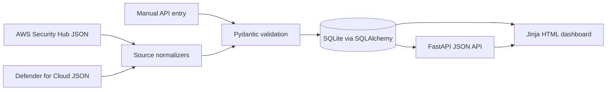

# Cloud Security Findings Dashboard

A portfolio-ready MVP for bringing cloud-security findings into one understandable remediation workflow. It imports simulated AWS Security Hub and Microsoft Defender for Cloud records, validates and normalizes them, stores them in SQLite, and presents security leaders and engineering teams with actionable ownership, SLA, severity, and cloud-provider metrics.

> Screenshot placeholder: add a dashboard screenshot at `docs/dashboard.png` after deployment.

## Architecture



The app deliberately uses one deployable FastAPI service. Route handlers deal with HTTP, `services/normalization.py` maps vendor data, `services/importer.py` manages per-record import outcomes, SQLAlchemy owns persistence, and Pydantic defines the API boundary. Jinja templates plus a small amount of dependency-free JavaScript provide the UI.

## Quick start

Python 3.10+ is recommended (the container and CI use 3.12).

```bash
python3 -m venv .venv
source .venv/bin/activate
pip install -r requirements.txt
uvicorn app.main:app --reload
```

Open <http://localhost:8000>. Interactive API documentation is at <http://localhost:8000/docs>.

Import the included data to populate the dashboard:

```bash
curl -X POST http://localhost:8000/api/imports \
  -H 'Content-Type: application/json' \
  --data-binary @sample-data/aws-security-hub.json

curl -X POST http://localhost:8000/api/imports \
  -H 'Content-Type: application/json' \
  --data-binary @sample-data/microsoft-defender-cloud.json
```

### Docker

```bash
docker compose up --build
```

Compose persists SQLite in a named volume. No credentials are required.

## API examples

List filtered, overdue findings:

```bash
curl 'http://localhost:8000/api/findings?severity=high&provider=aws&overdue=true'
```

Create a manual finding:

```bash
curl -X POST http://localhost:8000/api/findings \
  -H 'Content-Type: application/json' \
  -d '{
    "source":"manual","source_finding_id":"IR-1042","title":"Public database snapshot",
    "description":"A production snapshot is shared publicly.","severity":"critical","status":"open",
    "cloud_provider":"aws","account_id":"111122223333","resource_type":"RDS snapshot",
    "resource_id":"rds:prod-snapshot","application":"Billing","owner":"Platform Security",
    "environment":"production","first_detected_at":"2026-08-05T10:00:00Z","due_date":"2026-08-06",
    "remediation_guidance":"Remove public sharing and review snapshot access logs."
  }'
```

Resolve a finding (the note is mandatory):

```bash
curl -X PATCH http://localhost:8000/api/findings/FINDING_UUID \
  -H 'Content-Type: application/json' \
  -d '{"status":"resolved","resolution_note":"Public sharing removed; access reviewed."}'
```

Other useful endpoints are `GET /api/findings/{id}`, `GET /api/dashboard/summary`, `GET /health`, and the generated OpenAPI documentation.

## Data model

`findings` holds the normalized business record: UUID, source identity, title and description, normalized severity and status, provider/account/resource context, application and team ownership, environment, first-detected and due dates, remediation and resolution text, and created/updated timestamps. `(source, source_finding_id)` is a database uniqueness constraint as well as an import-time duplicate check.

`status_audits` records finding ID, old status, new status, and change timestamp. It is intentionally focused on status history for the MVP.

Overdue is not stored. It is calculated from the current date on every read: a finding is overdue when its due date is before today and its status is not `resolved`. This keeps time-dependent state accurate. Suppressed and accepted-risk records remain visible as overdue when their due date has passed, while headline “open” metrics count only `open` and `in_progress` work.

## Normalization rules

| Source | Source value | Normalized value |
|---|---|---|
| AWS severity | `CRITICAL`, `HIGH`, `MEDIUM`, `LOW`, `INFORMATIONAL` | lowercase equivalent |
| AWS workflow | `NEW`, `NOTIFIED`, `RESOLVED`, `SUPPRESSED` | `open`, `in_progress`, `resolved`, `suppressed` |
| Azure severity | `High`, `Medium`, `Low`, `Informational` | lowercase equivalent |
| Azure status | `Active`, `InProgress`, `Resolved`, `Dismissed`, `AcceptedRisk` | `open`, `in_progress`, `resolved`, `suppressed`, `accepted_risk` |

AWS account/resource data comes from `AwsAccountId` and the first `Resources` item. Azure context comes from `properties.resourceDetails`. Sample-only ownership metadata is mapped from AWS `ProductFields` and Azure `properties.metadata`. Unknown enum values and missing required fields fail that individual record, with its array index, source ID when available, and a readable error returned to the caller. Other valid records in the same batch still commit.

## Tests

```bash
pytest -q
```

The suite covers both source normalizers, invalid records, partial imports, duplicates, filtering and search, dynamic overdue behavior, resolved transitions, resolution-note enforcement, audit history, summary metrics, CRUD endpoints, health, and rendered pages. GitHub Actions compiles the application, runs all tests, and verifies the Docker build.

## Assumptions

- Inputs model stable exported payloads rather than the complete vendor schemas.
- Each source record represents one resource; AWS uses the first listed resource.
- Dates are ISO 8601 and due dates are calendar dates evaluated in the server's local date.
- Owner, application, and environment are mandatory because remediation metrics without ownership are not useful.
- Imports are synchronous and intended for small demo batches.

## Security considerations

Imported content is untrusted: Pydantic constrains types and sizes, required fields are checked, SQLAlchemy parameterizes database queries, and the UI HTML-escapes API content before inserting it. The service contains no cloud credentials or secrets and should receive its database URL through the environment. Docker runs as a non-root user. In production, add authentication and role-based authorization, request-size and rate limits, CSRF protection for cookie-authenticated write operations, a restrictive content-security policy, structured security logs, dependency/image scanning, encrypted backups, and TLS at the edge.

SQLite is suitable for this single-process MVP, not a horizontally scaled or high-write deployment. Error responses are designed to help operators without returning stack traces.

## False positives and accepted risk

`suppressed` is intended for a false positive, duplicate signal, or non-applicable control. `accepted_risk` represents a real exposure with a documented business decision. They are separate so metrics do not imply that a known risk was technically remediated. A production workflow should require rationale, approver, expiry/review date, and compensating controls for both; accepted risk should automatically return to review at expiry. The MVP stores the rationale in `resolution_note` when provided but does not enforce approval governance.

## Production improvements

- PostgreSQL, Alembic migrations, transactional batch imports, pagination, and background jobs for large feeds
- OIDC/SSO, RBAC, tenant isolation, and immutable actor-aware audit events
- Native Security Hub and Defender connectors using workload identity and least-privilege read access
- Configurable SLA policies, business calendars, risk acceptance expiry, and service ownership catalog integration
- Trend snapshots, mean-time-to-remediate, aging buckets, export, saved views, and accessible chart components
- Observability with structured logs, traces, metrics, health/readiness checks, and alerting
- Schema versioning, idempotency keys, import file limits, malware/content scanning where appropriate, and dead-letter handling
- Browser accessibility tests, load tests, database backup/restore exercises, and a full security review
